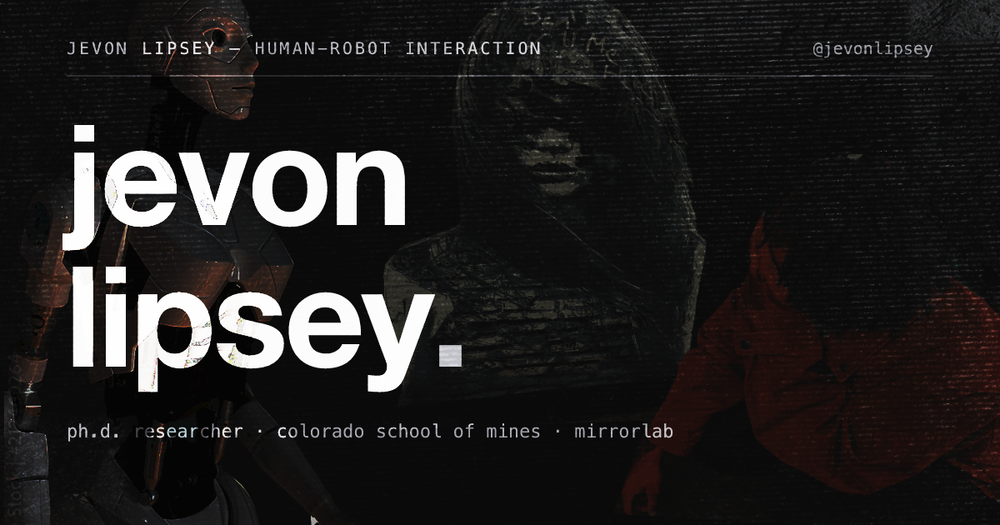

# jevonlipsey.com



personal academic portfolio for me! jevon lipsey (cs ph.d., colorado school of mines, mirrorlab).
<div align="center">
  
  
  
  
  
  
</div>

## identity + links

everything identity lives in `src/site.config.ts` — site name, emails, github / scholar / cv / resume, socials. it feeds the hero, about page, navbar, footer, and og meta.

## content

all content is markdown / mdx in `src/content/`. three collections:

### research (`src/content/research/`)

frontmatter: `title`, `venue`, `acronyms`, `year`, `status`, `authors`, `abstract`, `pdf?`, `code?`, `bibtex?`, `featured`

- `acronyms` is the list of short venue chips rendered next to papers (e.g. `['HRI']`). falls back to the full `venue` string when empty.
- `status` is one of: `published`, `in-review`, `accepted`, `camera-ready`, `workshop`, `best-paper`, `preprint`. badge labels live in `src/components/StatusBadge.astro` — add new states there, not in templates.
- `featured: true` pins the paper on the homepage's selected research list.

### projects (`src/content/projects/`)

frontmatter: `title`, `desc`, `links`, `tech`, `metric?`, `featured`

- `links` is a map with `github`, `demo`, `appstore`, `caseStudy` slots. each present slot renders as a bracketed action (`[source]`, `[demo]`, `[app store]`, `[case study]`). the card's primary target picks the first present slot in that order; `caseStudy` points at an in-site page, everything else opens a new tab.
- `featured: true` shows the project on the homepage.

### thoughts (`src/content/thoughts/`)

frontmatter: `title`, `date`, `summary`, `tags`, `draft`

- posts can be `.mdx` so you can import the editorial image component:

```mdx
<Figure
  src="/thoughts/pepper1.webp"
  alt="pepper in the lab"
  size="md"
  caption="some caption"
/>
```

`Figure` takes `size` (xs/sm/md/lg/full), `aspect` (auto/square/video/portrait), `align` (center/left/right), and strips `/public` prefixes.

- tags link to `/thoughts?tag=x`, which pre-filters the archive (see `ThoughtsArchive.tsx`).
- `draft: true` hides the post from `/thoughts` and the homepage.

## static assets (`public/`)

served at root. pdfs (`cv.pdf`, `lipsey-resume.pdf`), the robot model (`models/jev_cyborg.web.glb`), og / avatar / favicons. swap pdfs in place, no other step.

drop a `.png` / `.jpg` / `.jpeg` anywhere in `public/` and `npm run build` auto-converts it to `.webp` (q82, max 2000px wide) via the `prebuild` hook — references in `src/` are rewritten and the original is removed. run `npm run optimize:images` to do it without building. `og.png` is the one hard exclusion (hand-finished).

## commands

```bash
npm install              # deps
npm run dev              # dev server on 4321
npm run check            # astro + ts diagnostics
npm run build            # static build to dist/ (auto-converts images first)
npm run preview          # serve the built site
npm run test:motion      # headless motion unit tests
npm run optimize:images  # convert public/ pngs+jpegs to webp (runs with build)
npm run optimize:model   # glb -> web glb (meshopt + webp textures)
```

## robot model pipeline

the site loads `public/models/jev_cyborg.web.glb`(3mb). the blender source and original export live in `assets-src/`. after editing in blender, run `npm run optimize:model` to regenerate the web glb. the asset pipeline is one-way: keep assets-src committed and never point the loader back at the raw glb.

## og image

`public/og.png` is hand-finished (editable source: `assets-src/og.afdesign`). do NOT run `scripts/optimize-images.mjs` or `npm run og:generate` — both overwrite it.

## deploy (cloudflare pages)

build command `npm run build`, output directory `dist`, node 22. the custom domain `jevonlipsey.com` is wired through the cloudflare dashboard. `public/_headers` sets cache-control (immutable for hashed astro assets), `robots.txt` points at `sitemap-index.xml` from the sitemap integration.

## notes

- reading pages are zero-js; only islands hydrate (`client:load` for the scene, `client:visible` for interactive widgets).
